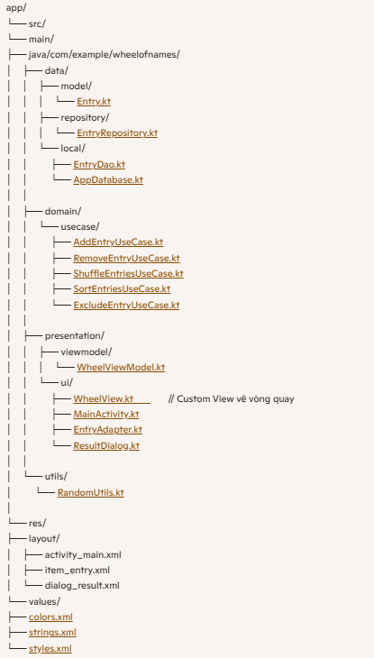

# 🎡 DZLuckyWheel

## 📂 Cấu trúc dự án

---

## 🚀 Thứ tự phát triển theo từng bước

### 1. Khởi động tối thiểu: Activity + layout trống
- **Mục tiêu:** App chạy lên được với màn hình trống.
- **Việc cần làm:**
    - `MainActivity.kt`: setContentView(activity_main).
    - `activity_main.xml`: Layout đơn giản.
- **Kiểm tra:** Build & Run → màn hình trắng, không crash.

---

### 2. Khai báo Model, Repository và Use Case chạy in-memory
- **Mục tiêu:** Có logic cơ bản, chưa gắn DB, vẫn test được.
- **Việc cần làm:**
    - Model: `Entry.kt` + `EntryType`.
    - Repository: `EntryRepository.kt` + tạm thời `InMemoryEntryRepository`.
    - Use case: Add/Remove/Shuffle/Sort/Exclude.
- **Kiểm tra:** Gọi thử use case trong ViewModel hoặc log.

---

### 3. Kết nối ViewModel và UI đơn giản
- **Mục tiêu:** View ↔ ViewModel hoạt động, UI cập nhật theo state.
- **Việc cần làm:**
    - `WheelViewModel.kt`: LiveData/StateFlow cho danh sách entries.
    - `item_entry.xml` + `EntryAdapter.kt`: RecyclerView hiển thị entries.
    - `MainActivity.kt`: Observe ViewModel, cập nhật RecyclerView.
- **Kiểm tra:** Tạo vài entry mặc định, bấm nút → danh sách thay đổi.

---

### 4. Tạo Custom View vòng quay (WheelView) vẽ tĩnh
- **Mục tiêu:** Vẽ vòng tròn chia lát theo số lượng entry.
- **Việc cần làm:**
    - `WheelView.kt`: override onDraw, tính sweepAngle, vẽ drawArc.
    - `activity_main.xml`: thêm WheelView + 3 nút.
- **Kiểm tra:** 4–8 entry → lát đúng, màu đúng.

---

### 5. Xử lý chạm vào tâm, animation quay và chọn lát trúng
- **Mục tiêu:** Bấm vào giữa vòng quay → quay → hiện dialog kết quả.
- **Việc cần làm:**
    - `WheelView.kt`: rotationAngle, touch center, animate.
    - `RandomUtils.kt`: sinh góc đích, bỏ qua excluded.
    - `ResultDialog.kt`: hiển thị kết quả với Close/Remove.
- **Kiểm tra:** Spin chọn đúng lát, dialog hoạt động.

---

### 6. Khu vực nhập entry và 3 nút điều khiển
- **Mục tiêu:** Nhập nhiều dòng, shuffle, sort, thêm ảnh.
- **Việc cần làm:**
    - `activity_main.xml`: EditText multiline + 3 nút.
    - `MainActivity.kt`: parse dòng → TEXT entries; Add Image dùng `ACTION_OPEN_DOCUMENT`.
    - `EntryAdapter.kt`: hiển thị TEXT/IMAGE.
- **Kiểm tra:** Nhập → entries xuất hiện; shuffle/sort hoạt động; ảnh thêm được.

---

### 7. Tính năng mật: 7 lần bấm Sort
- **Mục tiêu:** Đánh dấu entry “không bao giờ trúng”.
- **Việc cần làm:**
    - `MainActivity.kt`: đếm số lần bấm Sort; đến 7 → mở SecretDialog.
    - `SecretDialog`: nhập tên/ảnh → set excluded = true.
    - `ViewModel`: spin bỏ qua excluded.
- **Kiểm tra:** Entry bị exclude không bao giờ trúng.

---

### 8. Thay thế in-memory bằng Room
- **Mục tiêu:** Dữ liệu tồn tại sau khi tắt app.
- **Việc cần làm:**
    - `AppDatabase.kt`, `EntryDao.kt`: CRUD.
    - Repository Room implementation.
    - ViewModel: load từ DB, update state.
- **Kiểm tra:** Thêm/xóa/exclude → restart app → dữ liệu còn.

---

### 9. Tối ưu hiển thị, ảnh và hiệu năng
- **Mục tiêu:** Vòng quay mượt, ảnh không làm đơ UI.
- **Việc cần làm:**
    - Precompute geometry.
    - Cache thumbnail, decode hợp lý.
    - Thêm hiệu ứng confetti (tùy chọn).
- **Kiểm tra:** 50–100 entries vẫn mượt.

---

### 10. Xử lý edge cases và vòng đời
- **Mục tiêu:** Ổn định trong mọi tình huống.
- **Việc cần làm:**
    - Empty list: disable spin.
    - Single entry: spin deterministic.
    - All excluded: chặn spin.
    - Trùng tên: exclude theo id/URI.
    - Lưu rotation state.
- **Kiểm tra:** Xoay màn hình, từ chối quyền ảnh, danh sách trống.

---

## ✅ Tổng kết
README này lưu lại **cấu trúc dự án** và **10 bước phát triển** để xây dựng DZLuckyWheel một cách tuần tự, dễ kiểm soát.
